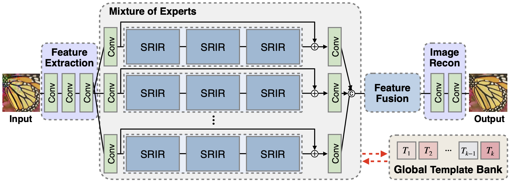

## Restoring Spatially-Heterogeneous Distortions using Mixture of Experts Network (ACCV 2020)

This repository provides the official PyTorch implementation of the following paper:
> **Restoring Spatially-Heterogeneous Distortions using Mixture of Experts Network (ACCV 2020)** 
> Sijin Kim\*, [Namhyuk Ahn](https://nmhkahn.github.io)\*, [Kyung-Ah Sohn](https://sites.google.com/site/kasohn/home) 
> Ajou University 
> * indicates equal contribution. 
> [http://arxiv.org/abs/2009.14563](http://arxiv.org/abs/2009.14563) 
>
> **Abstract:** *In recent years, deep learning-based methods have been successfully applied to the image distortion restoration tasks. However, scenarios that assume a single distortion only may not be suitable for many real-world applications. To deal with such cases, some studies have proposed sequentially combined distortions datasets. Viewing in a different point of combining, we introduce a spatially-heterogeneous distortion dataset in which multiple corruptions are applied to the different locations of each image. In addition, we also propose a mixture of experts network to effectively restore a multi-distortion image. Motivated by the multi-task learning, we design our network to have multiple paths that learn both common and distortion-specific representations. Our model is effective for restoring real-world distortions and we experimentally verify that our method outperforms other models designed to manage both single distortion and multiple distortions.*

### We will release the code soon.
